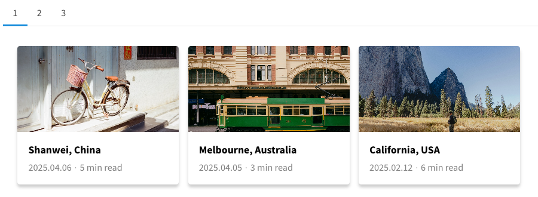

<div align="center">

# docsify-dashboard

[](https://www.npmjs.com/package/docsify-dashboard)
[](https://github.com/erectbranch/docsify-dashboard/blob/master/LICENSE)

A plugin for [Docsify](https://docsify.js.org/#/) that creates a dashboard from a metadata.



</div>

## Import

To use the dashboard, you need to include the plugin in your Docsify `index.html` file:

> **Note:** This plugin requires [docsify-tabs](https://jhildenbiddle.github.io/docsify-tabs/#/) plugin. (Make sure to include it after the docsify-dashboard plugin)

**Add stylesheet**

```html
<link rel="stylesheet" href="https://cdn.jsdelivr.net/npm/docsify-dashboard@3.0.0/dist/dashboard.min.css">
```

**Add script**

```html
<script src="//cdn.jsdelivr.net/npm/docsify-dashboard@3.0.0/dist/docsify-dashboard.min.js"></script>

<!-- The docsify-tabs plugin (must be included after the docsify-dashboard plugin) -->
<script src="https://cdn.jsdelivr.net/npm/docsify-tabs@1/dist/docsify-tabs.min.js"></script>
```

## Structure

The following directory structure is used:

- `tags.md`: Empty file for rendering a dashboard by tags in the URL. (e.g., `#/tags?tag=plugin`)

- `posts.json`: Metadata file containing the posts information.

```bash
.
└── docs
    ├── index.html
    └── tags.md
    └── metadata
        └── posts.json
```

Metadata file example(`metadata/posts.json`)

> **Notes**: "*subtitle*", "*category*" information is optional

```json
[
    {
        "time": "2025.04.06",
        "title": "Shanwei, China",
        "tag": "5 min read",
        "image": "assets/images/shanwei.jpg",
        "href": "#/topic-one"
    },
    {
        "time": "2025.04.05",
        "title": "Melbourne, Australia",
        "tag": "3 min read",
        "image": "assets/images/melbourne.png",
        "href": "#/topic-two",
        "subtitle": "A beautiful city in Australia",
        "category": "travel"
    }
]
```

## Usage

### Dashboard

You can create a dashboard by adding the following code to your markdown file:

```markdown
<!-- tabs:start -->

<!-- dashboard -->

<!-- tabs:end -->
```

To display posts from a specific category only, you can use the following code:

```markdown
<!-- dashboard:categoryName -->
```


### Tag-dashboard

You can display a tag list by adding the following code to your markdown file:

- **In sidebar file**: display all tags in the metadata.

- **In markdown file**: only display the current page's tags.

```markdown
<!-- tag-list -->
```

It will redirect to the tag-dashboard containing all posts that have the same tag.

## Example

### Footer with Page Tags

Add a page footer to display the tags on each page.

```javascript
window.$docsify = {
  plugins: [
    function pageFooter(hook, vm) {
      var footer = [
        '<!-- tag-list -->',
        '<hr/>',
      ].join('');

      hook.afterEach(function (html) {
        return html + footer;
      });
    },
  ],
};
```

---

## Configuration

To configure the dashboard, you can set options in your `index.html` file. The available options are:

- **Theme**: `default`, `cards`, `list`

| Option | Type | Default | Description |
| --- | --- | --- | --- |
| `numTabContent` | `Int` | 3 | Number of cards to show in a docsify-tabs slide. |
| `metadataUrl` | `String` | 'metadata/posts' | JSON URL to fetch metadata. |
| `sort` | `Boolean` | false | Sort the posts by time. (`YYYY.MM.DD`, `YYYY/MM/DD`) |
| `theme` | `String` | 'default' | Theme for the dashboard. |
| `tagboardTheme` | `String` | 'default' | Theme for the tag-dashboard. |
| `pagination` | `Boolean` | false | Enable pagination for the dashboard tabs. |

```javascript
window.$docsify = {
  dashboard: {
    numTabContent: 3,
    metadataUrl: 'metadata/posts',       // do not include '.json' extension
    sort: false,                         // sort the posts by time
    theme: 'default',                    // (1) default, (2) cards, (3) list
    tagboardTheme: 'default',            // options are same as above
    pagination: false                    // enable pagination for the dashboard
  }
};
```

---

## Customization

The dashboard can be customized using CSS. You can override the following CSS variables.

### Dashboard

To change the styles, you can add the following CSS to your `index.html` file:

```html
<style>
  /* default */
  :root {
    /* card style */
    --dashboard-card-border-radius: 5px;
    --dashboard-card-margin-top: 10px; 
    --dashboard-card-bg-color: #ffffff; 
    --dashboard-card-max-width: 330px;
    --dashboard-card-min-height: 220px;
    --dashboard-card-shadow: 0 0.3em 0.3em rgba(0,0,0,0.2);

    /* card text */
    --dashboard-card-text-align: left; 
    --dashboard-card-text-color: #000000;
    --dashboard-card-title-font-size: 1.2rem; 
    --dashboard-card-title-font-weight: bolder;
    --dashboard-card-subtitle-font-size: 1rem; 
    --dashboard-card-subtitle-color: #808080; 
    --dashboard-card-date-font-size: 0.8rem; 
    --dashboard-card-date-color: #808080;

    /* card image */
    --dashboard-card-img-min-width: 100%;
    --dashboard-card-img-min-height: 160px;
    --dashboard-card-img-max-height: 160px;
    --dashboard-card-img-border: 0.1em solid #ced4da;

    /* list theme */
    --dashboard-list-theme-max-width: var(--content-max-width, 100%);
    --dashboard-list-theme-img-max-width: 200px;

    /* pagination style */
    --pagination-tab-font-size: 1.1rem;
    --pagination-tab-highlight-color: var(--theme-color, #dbe8f0);
  }
</style>
```

### Tag-dashboard

To change the tag-list styles, add the following CSS:

```html
<style>
  /* default */
  :root {
    --tags-bg-color: #fafbfbff;
    --tags-font-color: #54cca7ff;
    --tags-font-size: var(--base-font-size);
    --tags-margin-top: 5px;

    --sidebar-tags-bg-color: var(--tags-bg-color);
    --sidebar-tags-font-color: var(--tags-font-color);
    --sidebar-tags-font-size: var(--tags-font-size);
    --sidebar-tags-margin-top: var(--tags-margin-top);
  }
</style>
```

---

## License

This project is licensed under the GNU General Public License v3.0.

- Original work © 2023–2025 李亦楊 ([@pikapikapikaori](https://github.com/pikapikapikaori))

- Modified work © 2025 Sungjae Jeon ([@erectbranch](https://github.com/erectbranch))

See [LICENSE](LICENSE) for more details.

---

## Contribution

Please feel free to submit a pull request or open an issue on the GitHub repository. Your contributions are welcome and appreciated!

---